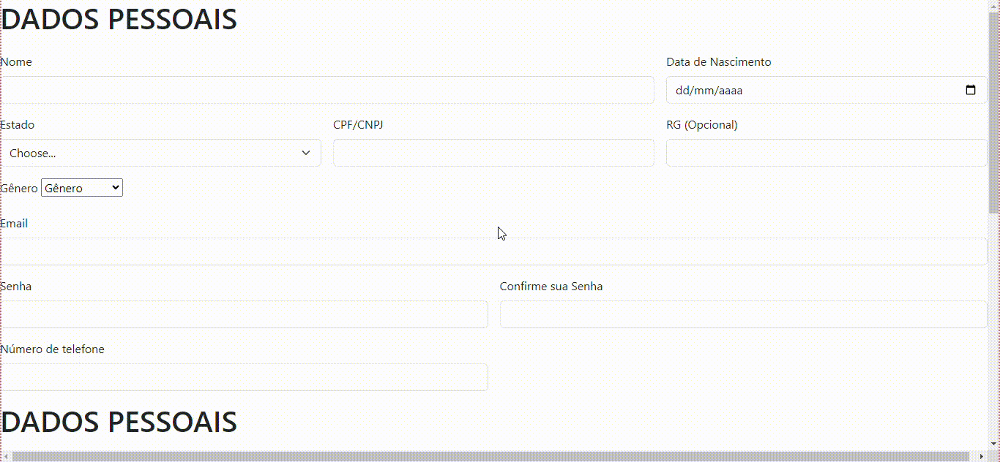

# Formulário

## Descrição
Um protótipo de um site de Ecommerce. Para a criação desse site foi utilizado de refêrencia os sites que foram citados a baixo, e apartir deles foi criado um próprio modelo de cadastro.

## Função
O site tem a função de emular um site do estilo Ecommerce na sua parte de cadastr. Com isso foi preciso que colocasse alguns informações que sites de estilo pedem.

## Sites pesquisados
3 sites do formato Ecommerce foram utilizados como referência para o trabalho sendo os sites: Shopee, Netshoes e Pichau. 

### SHOPEE
Shopee é um site que vende itens em geral, como sapatos, comida, brinquedos e etc. A plataforma foi lançada em 2015 por uma empresa chamada Sea group, anteriormente sendo conhecida como Garena, tendo um outro produto muita famoso o jogo "Free fire". O criador da ideia Shopee se chama Forrest Li.

### NETSHOES
Netshoes é um site do tipo Ecommerce que tem como objetivo a venda de sapatos, tênis e outros tipos de calçados. Fundada em fevereiro do ano 2000 pelo Marcio Kumruian e Hagop Chabab, porém ela foi comprada em 2019 pela empresa Magazine luiza e atualmente ainda se encontra em posse da empresa.

### PICHAU
Pichau é uma empresa do estilo Ecommerce que vende produtos para computadores, como gabinetes, fones, mouses e etc. Fundada em 2007 pelo João Carlos Pichau, sendo uma empresa independente, ainda tendo uma loja fisíca em Joinville.

## Tecnologias utilizadas 

* ``HTML 5``
* ``Github``
* ``VsCode``
* ``Microsoft Teams``
* ``SHOPEE ``
* ``NETSHOES ``
* ``PICHAU``